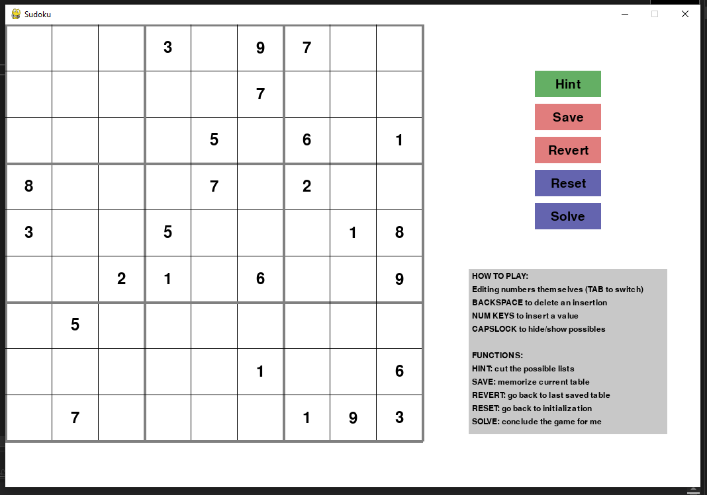
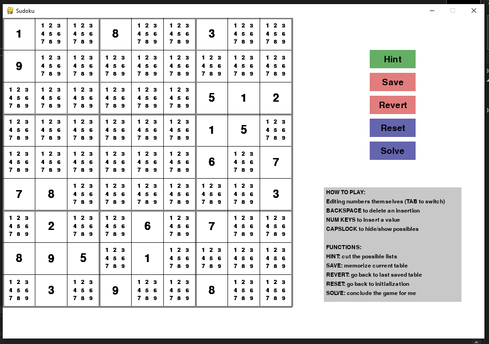
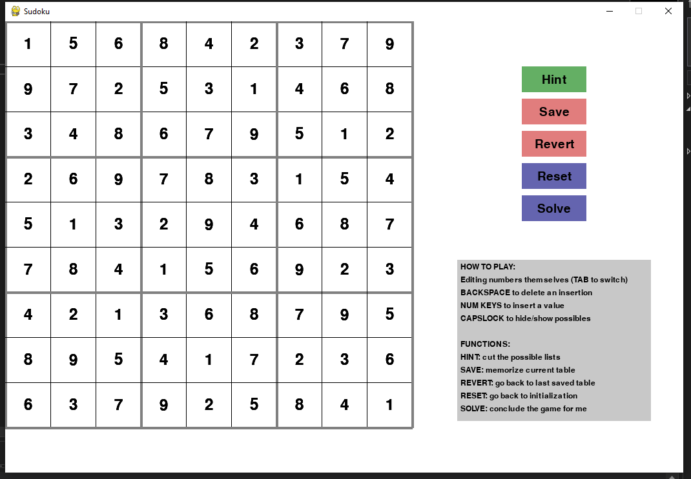

A simple project to train my python programming skills, an object oriented implementation that allows to play and solve sudoku games throught a pygame graphical interface.

Here you can see some visuals from the game:

